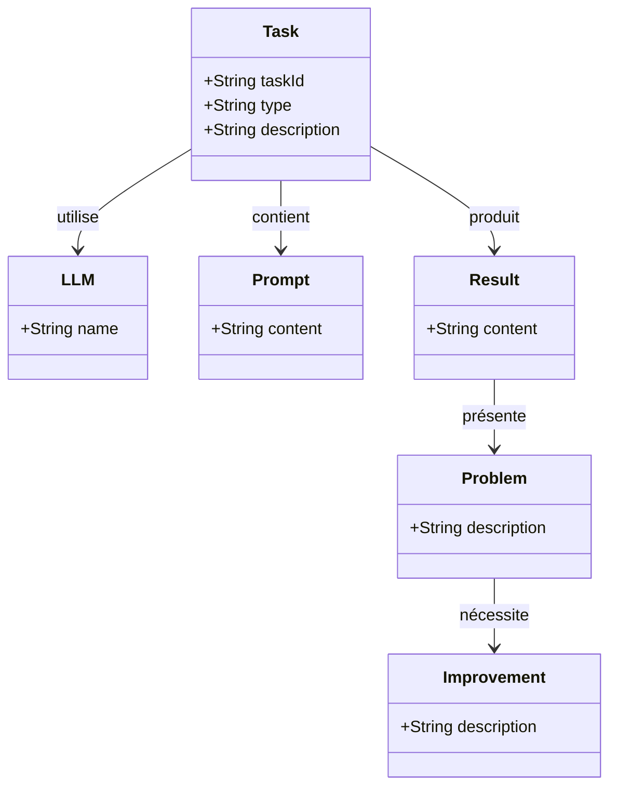

# Diagramme de classes - Exercice 10.a

Ce diagramme représente les principales informations utilisées pour
décrire une tâche, le modèle utilisé et le résultat obtenu.

```mermaid
classDiagram

    class Task {
        +String taskId
        +String type
        +String description
    }

    class LLM {
        +String name
    }

    class Prompt {
        +String content
    }

    class Result {
        +String content
    }

    class Problem {
        +String description
    }

    class Improvement {
        +String description
    }

    Task --> LLM : utilise
    Task --> Prompt : contient
    Task --> Result : produit
    Result --> Problem : présente
    Problem --> Improvement : nécessite
```
