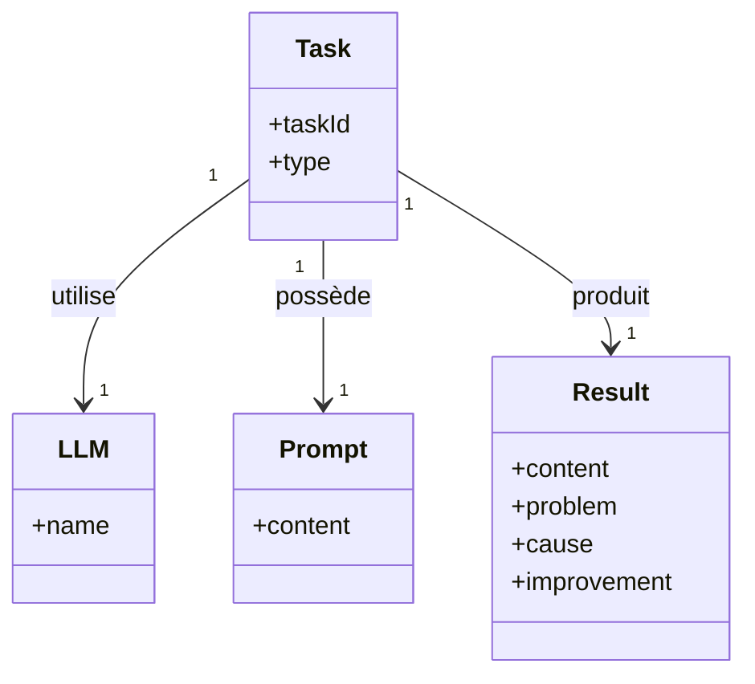

# Diagramme de classes - Exercice 10.a

```mermaid
classDiagram

    Task "1" --> "1" LLM : utilise
    Task "1" --> "1" Prompt : possède
    Task "1" --> "1" Result : produit

    class Task {
        +taskId
        +type
    }

    class LLM {
        +name
    }

    class Prompt {
        +content
    }

    class Result {
        +content
        +problem
        +cause
        +improvement
    }
```
